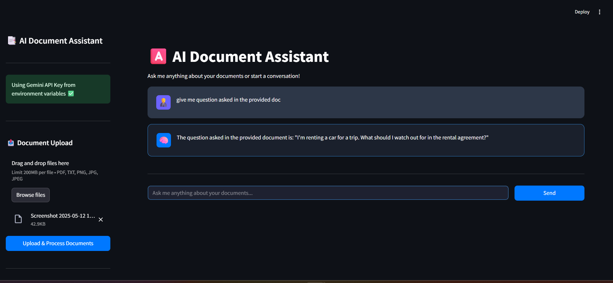

# Multi-Modal RAG System

Advanced Retrieval-Augmented Generation for document processing and Q&A



## Features 🚀

- **Multi-Document Processing**
  - 📜 PDFs (text + table extraction)
  - 🖼️ Images (OCR via Tesseract)
  - 📄 Text files
- **AI-Driven Q&A**
  - 💬 Natural language responses
  - 🔎 Semantic search with ChromaDB
  - 🧩 LangChain integration
- **Enterprise-Grade**
  - 🔒 Secure, non-root Docker execution
  - 📊 Scalable vector database
  - ⚡ Asynchronous processing
- **Seamless Integration**
  - 🐳 Docker-first deployment
  - 🌐 REST API endpoints
  - 🛠️ Configurable via env variables

## Getting Started

### Prerequisites

- Docker Engine 20.10+
- Docker Compose 2.20+
- Python 3.11

### Installation

```bash
# Clone the repo
git clone https://github.com/naushadali1/AI-Document-Assistant
cd AI-Document-Assistant

# Set up environment
cp .env.example .env

# Build and run services
docker-compose up --build -d

# Check containers
docker-compose ps
```

## Access Points

1. **REST API**: Programmatic access at `:8080`
2. **Web UI**: User-friendly interface at `:8501`

| Component     | Type          | URL                                           | Port |
| ------------- | ------------- | --------------------------------------------- | ---- |
| API Docs      | Swagger UI    | http://0.0.0.0:8080/docs                      | 8080 |
| Streamlit App | Web UI        | http://0.0.0.0:8501 or http://localhost:8501/ | 8501 |
| API Base URL  | REST Endpoint | http://0.0.0.0:8080                           | 8080 |

### Naushad Ali

### AI Engineer
